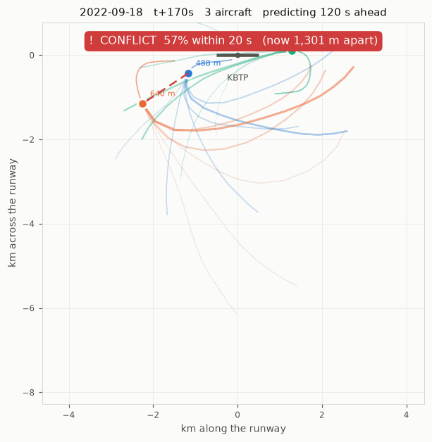
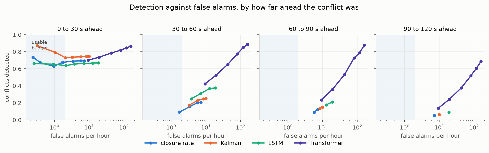
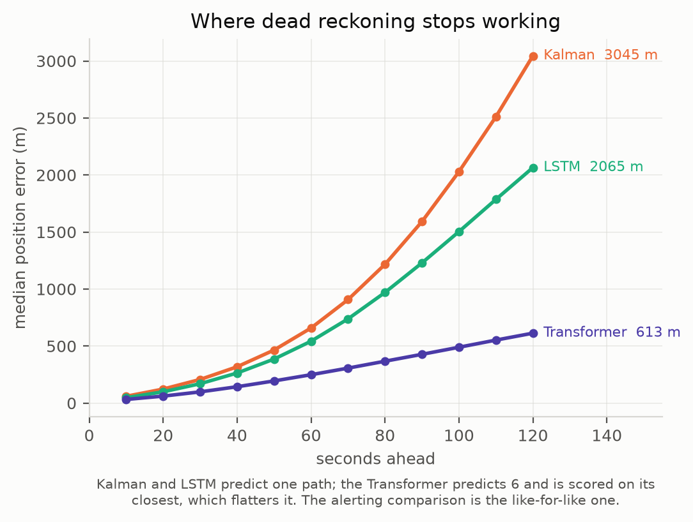
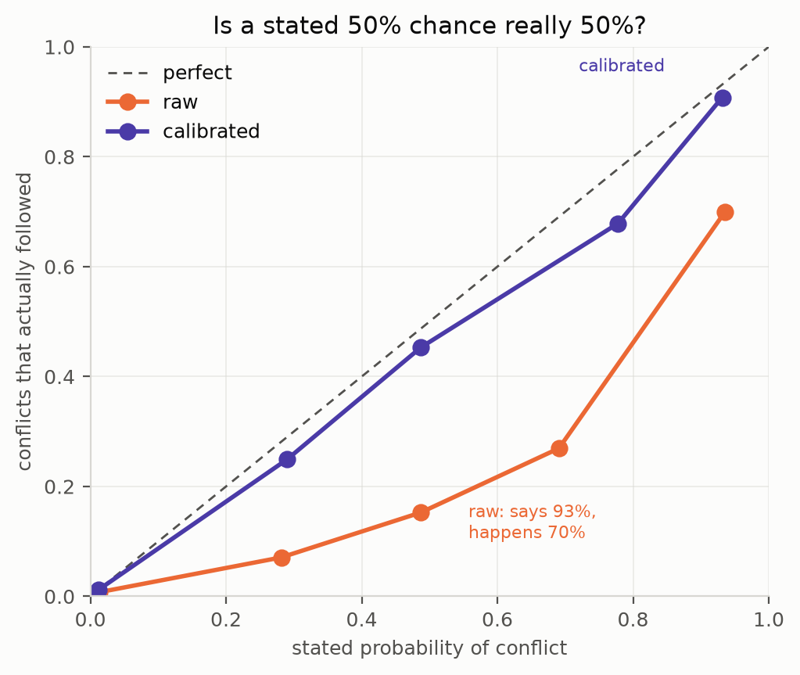
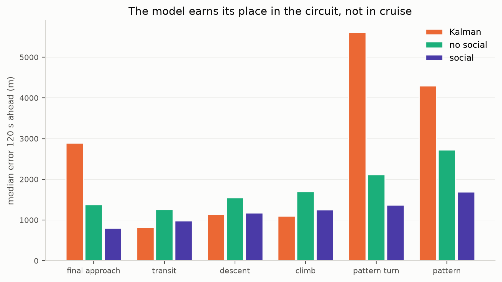
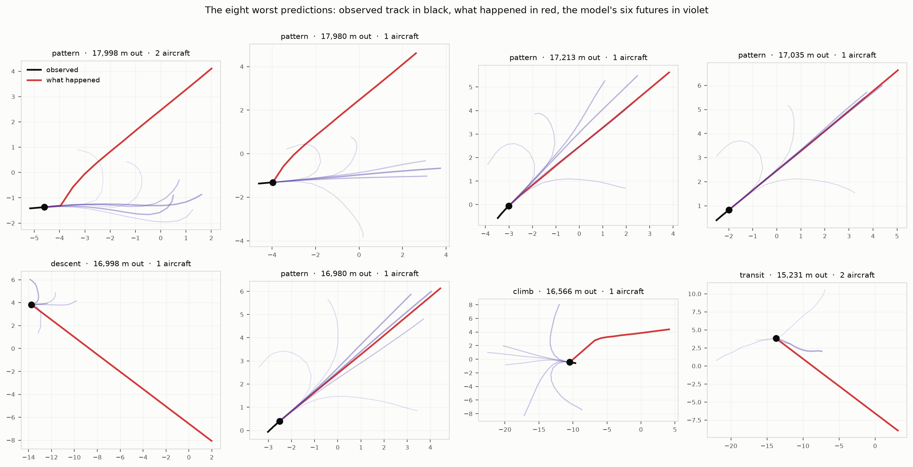
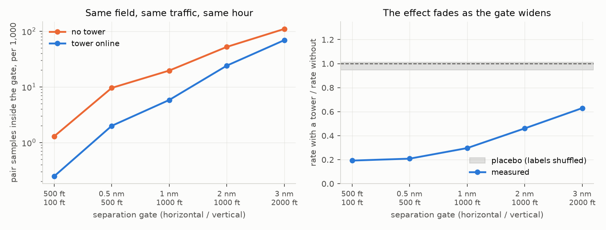

# PCAS: Predictive Collision Awareness System

Learned conflict warning for airports **without a control tower**, where most midair
collisions happen and where certified collision avoidance systems are least useful.

> **Headline:** a multi-agent Transformer with social attention detects **2.2x more conflicts
> 90 seconds ahead** than a Kalman filter at the same false alarm rate, and states a calibrated
> probability while doing it. An ablation attributes the gain to seeing the other aircraft
> rather than to the architecture: with neighbours hidden, the same model scores like an LSTM.
> Physics still wins inside 30 seconds, and that is reported too.

## What it looks like



Recorded ADS-B from a held-out session at KBTP, replayed with the model running. Each aircraft
carries a trail of where it has been and a fan of six futures it might fly over the next two
minutes, with the thickness and opacity of each showing how likely the model thinks it is. When
two aircraft are predicted to lose separation the pair is joined by a dashed line and the
banner states the calibrated probability and how soon.

Nothing here is staged. The aircraft are recordings the model never trained on, and every
prediction is made from the eleven seconds before that frame. Regenerate with
`python scripts/make_replay.py`.

## In three pictures



Every method can detect more conflicts by alerting more, so each is swept over its own
sensitivity knob and read at a matched false alarm rate. Inside 30 s the physics baselines
lead and the shaded budget is where a real system would live. In the longer bands the social
Transformer is the only line that climbs at all.



Median position error against how far ahead the prediction reaches. Straight-line motion is a
good assumption for 20 s and a poor one at two minutes, which is exactly the window in which a
pilot could still act on a warning.



The model states a probability of conflict. Raw, it was overconfident by 2 to 4x; calibrated
on held-out sessions, it tracks the diagonal. Expected calibration error 0.0211 to 0.0005.

Figures regenerate from saved results with `python scripts/make_figures.py`.

## The problem

Most US airports have no tower. Pilots there separate themselves by looking out the window
and announcing their positions on a shared frequency. Meanwhile:

- **TCAS II** the certified system - is carried mainly by airliners and larger turbine
  aircraft, not the trainers and light singles flying the pattern at these fields.
- Even where it is carried, TCAS II **inhibits resolution advisories below roughly 1,000 ft
  AGL**, because telling an aircraft to descend near the ground is dangerous. The traffic
  pattern is flown at and below that altitude.
- Its logic is **geometric**: time-to-closest-approach from current closure rate. That works
  for two airliners converging in cruise. In a pattern, where aircraft turn constantly, it
  both misses conflicts that have not developed yet and fires on turns that resolve
  themselves.

PCAS asks whether a model that has *learned the shape of traffic at an airport* can warn
earlier than closure-rate logic at the same false-alarm rate.

**Headline metric:** warning lead time vs. false-alarm rate against a TCAS-style
closure-rate baseline. Trajectory error (minADE/minFDE) is a supporting metric, not the
result.

This is a research prototype, not a safety system. The direction is the same one the
industry is already taking - **ACAS X**, TCAS's successor, replaces geometric logic with
probabilistic prediction, and **ACAS Xu** targets exactly this airspace for drones.

*Not affiliated with, or related to, the discontinued Zaon PCAS product.*

## Approach

| Stage | Data | Why |
|---|---|---|
| Model training and evaluation | **ADS-B** (TrajAir benchmark, KBTP; OpenSky later) | Real flights, high sample rate, published baselines to compare against |
| Natural experiment + live demo | **VATSIM datafeed** | The only source where *controller presence is a variable*: the same airport is uncontrolled one hour and staffed the next |

The model is a multi-agent Transformer: attention over time within each aircraft's track,
and attention across aircraft in the same scene, predicting several possible futures with
calibrated probabilities. Those futures are turned into a conflict probability between
aircraft pairs, which is what actually raises an alert.

## Why VATSIM

Real ADS-B cannot answer "does traffic become more predictable when a controller is
online?", because a given airport's tower status barely changes. On VATSIM it changes hourly.
The feed publishes both pilot positions and which controllers are connected, so the same
field can be compared staffed vs. unstaffed:

- pattern conformance and spacing on final
- how often aircraft come close to each other
- whether an ML warning matters more when nobody is watching

**Caveats stated up front:** the feed updates only every ~15 s, which is coarse for
close-approach detection, and simulator pilots do not always fly like real ones. VATSIM
carries the analysis and the live demo; ADS-B carries the quantitative results.

The answer is below, in
[Does a controller's presence actually change anything?](#does-a-controllers-presence-actually-change-anything):
at the same field, same traffic level and same hour, close convergences are about three
times more frequent with no tower online.

## The collector

Polls the public VATSIM datafeed every 15 s (its refresh rate - the config refuses to go
faster) and appends to date-partitioned Parquet. Pilot rows keep position, altitude,
groundspeed, heading and flight plan; controller rows record which facilities are online.
The free-text `name` field on each connection is **not stored**, only the numeric CID, so
one aircraft's samples can be stitched into a track.

```bash
pip install -e ".[dev]"
python -m pcas.collect --once          # single poll, verify it works
python -m pcas.collect                 # run continuously; Ctrl-C flushes and exits
```

Output layout:

```
$PCAS_DATA_DIR/
  pilots/date=2026-09-25/pilots-20260925T140500.parquet
  controllers/date=2026-09-25/controllers-20260925T140500.parquet
```

Configure in `configs/collector.yaml`, or override the destination with `PCAS_DATA_DIR`.
The default data directory sits outside OneDrive on purpose, this grows by tens of MB per
day and syncing every flush would thrash the sync client.

Start it early: the controlled-vs-uncontrolled analysis needs weeks of accumulated history.

`pcas.collect.coverage` reports what was actually captured, per hour of the day. This
matters more than it sounds: the collector runs on a desktop that sleeps, and VATSIM
controller staffing peaks in the evening, so holes landing at the same hours every night
would make the controlled-vs-uncontrolled comparison measure collector uptime rather than
air traffic. Coverage is reported against full collection on every calendar day of the
span, including days missed entirely, so the gaps are stated rather than hidden.

## The ADS-B pipeline

Two tracks, deliberately kept separate.

**1. TrajAir's `processed_data`, for comparability.** Scene files are already in an
airport-centred frame (km, 1 Hz), so the loader only converts to metres. Used with the
dataset's own train/test split so numbers line up with published results (TrajAirNet,
[ASCENT](https://arxiv.org/abs/2603.16550)).

That split leaks, and we measured it: scene files are numbered with no date, and the 70/30
split is random over scenes, so **all 7 days of `7days1` appear on both sides**. A model
can be tested on the same day's traffic, often the same aircraft in the same pattern, that
it trained on. Published numbers on this split should be read with that in mind.

**2. Our own pipeline from `raw_data`, for the honest numbers.** The raw CSVs are one file
per day with absolute UTC timestamps, so rebuilding from them gives real dates, real times
(conflict labelling needs them to pair aircraft), and visible filtering choices:

| Step | Rule |
|---|---|
| Frame | lat/lon to metres, x along the runway (`geo.py`) |
| Ground | drop samples within 30 m of the field elevation, itself estimated from the data because the raw altitudes are not reliably MSL |
| Terminal area | keep traffic within 15 km; the receiver hears enroute aircraft out to 110 km |
| Gaps | split a track at any hole over 5 s instead of interpolating across it |
| Resample | interpolate onto whole seconds, 1 Hz |
| Frozen tracks | drop tracks whose whole path is under 200 m (stuck transponders) |

On `7days1` (7 days): **375 scenes, 17,683 windows, 6,097 of them multi-agent.** Windows are
11 s observed and 120 s predicted at 10 s steps, matching TrajAirNet's defaults.

Scene ids carry the date (`2020-09-24_2031`), so day-based and chronological splits read it
straight off the name and cannot leak a day across both sides.

**Known issue:** the frozen-track filter works per track, so a track that moves overall but
freezes for a stretch still gets through. A per-window check belongs with the baselines,
where a stationary target would otherwise flatter every metric.

## Results

Primary dataset is **TartanAviation KBTP**: 368 recording sessions (2020-08 to 2022-10), of
which 298 train, 30 validate and the last **40 are held out chronologically**. That is
500,294 training samples, 4.1x what TrajAir's 111 days gave. Errors in metres, best of K = 1,
over 83,958 test windows and 142,720 aircraft.

| model | params | minADE | minFDE (120 s) | vertical | median FDE |
|---|---|---|---|---|---|
| constant velocity | | 1594 | 3637 | 257 | 3058 |
| constant turn rate | | 1829 | 4058 | 250 | 3841 |
| Kalman (constant velocity) | | 1586 | 3626 | 258 | 3045 |
| LSTM, single aircraft | 3.1M | 1130 | 2539 | 123 | 2065 |
| Transformer, neighbours hidden | 503k | 1130 | 2538 | 125 | 2052 |
| **Transformer, social attention** | 503k | **925** | **2004** | **108** | **1342** |

## The central finding: context, not capacity

Four measurements, in the order they were made, each narrowing where the limit actually was:

| question | measurement | answer |
|---|---|---|
| Is it model size? | 223k params: val FDE 2485 m. 3.13M params: 2465 m | No: 14x capacity buys 0.8% |
| Is it optimisation? | Fixing target scaling cut epochs-to-converge ~10x | No: final test FDE moved 0.5% |
| Is it the architecture? | Transformer with neighbours **hidden**: minFDE 2538 m | No: matches the LSTM's 2539 m |
| Is it the missing context? | Same Transformer with neighbours **visible**: 2004 m | **Yes: 21% better** |

The third row is what makes this an attribution rather than a story. The ablation shares the
architecture, the cached input tensors, the loss, the schedule and the split with the social
model; only the neighbour tensor is masked. It lands within noise of the LSTM on every metric
measured, including each lead-time band (60 to 90 s detection: 0.225 against the LSTM's
0.225). So the gain is not "a Transformer beats an LSTM". It is "seeing the other aircraft
beats not seeing it".

Why that should be true is not mysterious. Aircraft in a traffic pattern are not independent:
a pilot extends the downwind to follow slower traffic, turns base early to fit in front of
someone, or goes around because the runway is occupied. None of that is inferable from one
aircraft's own last 11 seconds, and all of it is fairly predictable given the aircraft it is
sequencing with. It also explains why the gain grows with horizon: over 10 s an aircraft
simply continues, while over 90 s what it does is largely decided by who else is there.

## Alerting: where each method is actually worth using

Alerting on the 40 held-out sessions: 37,256 test windows holding 2 or more aircraft, 88,955
aircraft pairs, **1,686 conflicts**. Conflict = 0.5 nm horizontal and 500 ft vertical broken
at the same instant. Every method alerts at the last observed instant, is scored by identical
code, and is checked every second.

**Detection rates only mean something at a matched false alarm rate**, so each method is swept
over its own sensitivity knob (`artifacts/tradeoff_transformer.csv`, from
`scripts/alert_tradeoff.py`). Reading across at comparable budgets:

| false alarms/hour | method | 0 to 30 s | 30 to 60 s | 60 to 90 s | 90 to 120 s |
|---|---|---|---|---|---|
| ~0.3 | Kalman (horizon 10 s) | **0.872** | | | |
| ~1.7 | closure rate (tau 40) | 0.675 | 0.091 | | |
| ~1.7 | Transformer (horizon 30 s) | 0.665 | | | |
| ~2.1 | Kalman (horizon 30 s) | 0.730 | | | |
| ~3.4 | closure rate (tau 60) | 0.689 | 0.156 | | |
| ~3.3 | Kalman (horizon 40 s) | **0.736** | 0.174 | | |
| ~3.2 | **Transformer (horizon 40 s)** | 0.687 | **0.380** | | |
| ~5.7 | closure rate (tau 90) | 0.693 | 0.202 | 0.090 | |
| ~7.5 | **Transformer (horizon 60 s)** | 0.696 | **0.413** | | |
| ~10.0 | Kalman (horizon 120 s) | **0.746** | 0.249 | 0.151 | 0.063 |
| ~10.8 | **Transformer (margin 0.70)** | 0.348 | 0.303 | **0.251** | **0.126** |
| ~15.6 | **Transformer (horizon 90 s)** | 0.706 | **0.503** | **0.315** | |
| ~26.0 | Transformer (horizon 120 s) | 0.709 | 0.517 | 0.418 | 0.259 |

Read as advice about which method to deploy where:

1. **Under ~2 false alarms per hour, use physics.** Kalman detects 0.872 of conflicts arriving
   inside 10 s at 0.3 per hour. Nothing learned competes at that budget, and for a last-resort
   alert that is the right budget.
2. **Inside 30 s, physics still wins.** Kalman leads at every budget (0.73 to 0.75) with the
   Transformer close behind (0.67 to 0.71). Closure-rate logic sits between them. This band
   does not need a neural network.
3. **From 30 to 90 s, the learned model wins clearly, and at matched cost.** At ~3.3 per hour
   it detects 0.380 of 30 to 60 s conflicts against 0.174 for Kalman and 0.156 for closure-rate
   logic. At ~10.8 per hour it reaches 0.251 in the 60 to 90 s band against Kalman's 0.151 at
   10.0. Median lead time runs 3 to 23 s against 1 to 3 s for the physics methods.
4. **Past 90 s something finally works, barely.** 0.126 at ~10.8 false alarms per hour, twice
   Kalman's 0.063 at a comparable budget. Two minutes of warning remains mostly out of reach.
5. **The sensitivity knob changes the result as much as the model does.** Limiting the horizon
   keeps a predictor inside the regime where it is accurate; tightening the separation margin
   instead wrecks near-term detection (the Transformer drops to 0.348 at 0 to 30 s) while
   buying the long bands. Which knob a deployed system uses is an operational decision.

Two earlier conclusions in this file were withdrawn when this model arrived: "the 60 to 90 s
band is not a clear win" and "nothing works at 90 to 120 s". Both were true of the physics
baselines and the single-aircraft LSTM. Neither survived giving a model the other aircraft.

## Multimodal predictions, and an honest look at the probabilities

An aircraft on downwind either turns base or extends, and the average of those two futures is
a path it would never fly. So the model can emit K hypotheses with a probability each, trained
winner-takes-all with a cross-entropy over the mode logits. With two aircraft carrying K
hypotheses each, a pair has K x K possible futures, and the conflict probability is the weight
of the combinations that violate the threshold. The alert becomes a number rather than a
yes/no.

**The probability threshold turns out to be the best sensitivity knob available.** Compare the
three ways of quietening a predictor, at around 10 false alarms per hour:

| method | FA/hour | 0 to 30 s | 30 to 60 s | 60 to 90 s | 90 to 120 s |
|---|---|---|---|---|---|
| Kalman (horizon 120 s) | 10.0 | **0.746** | 0.249 | 0.151 | 0.063 |
| Transformer, 1 mode (margin knob) | 10.8 | 0.348 | 0.303 | 0.251 | 0.126 |
| **Transformer, 6 modes (P >= 0.50)** | 9.3 | 0.700 | **0.422** | 0.235 | **0.138** |

The single-mode model can only be made quiet by tightening its separation margin, which wrecks
near-term detection (0.348). The multimodal model is made quiet by raising the probability bar
instead, which keeps 0.700 close in while still beating the Kalman filter 1.7x at 30 to 60 s
and 2.2x past 90 s. Sweeping further trades false alarms for recall smoothly:

| P >= | FA/hour | 0 to 30 s | 30 to 60 s | 60 to 90 s | 90 to 120 s | median lead |
|---|---|---|---|---|---|---|
| 0.50 | 9.3 | 0.700 | 0.422 | 0.235 | 0.138 | 14 s |
| 0.35 | 19.3 | 0.736 | 0.523 | 0.360 | 0.241 | 23 s |
| 0.20 | 43.0 | 0.784 | 0.653 | 0.534 | 0.376 | 30 s |
| 0.05 | 116.9 | 0.844 | 0.847 | 0.788 | 0.606 | 39 s |

Those high-recall rows are not deployable at 40 to 120 false alarms per hour, but they do say
something worth knowing: the information needed to catch most conflicts two minutes ahead is
present in the data. What is missing is a way to be selective about it.

### The probabilities, before and after calibration

`AlertScorer.reliability()` compares what the model claimed against what happened. Raw, it is
overconfident by a factor of 2 to 4:

| stated probability | conflicts actually followed | pairs |
|---|---|---|
| 0.28 | 0.071 | 3,135 |
| 0.49 | 0.152 | 1,174 |
| 0.69 | 0.269 | 579 |
| 0.94 | 0.699 | 535 |

The ordering is sound, which is why thresholding it works, but a figure that reads as 30% and
means 7% cannot be shown to a pilot. So the probability is calibrated post-hoc: isotonic
regression, fitted on the **validation** sessions and reported on the **test** sessions, on
89,395 aircraft pairs against a map learned from 37,076 it never saw.

| stated probability | conflicts actually followed | pairs |
|---|---|---|
| 0.29 | **0.249** | 522 |
| 0.49 | **0.453** | 373 |
| 0.78 | **0.679** | 28 |
| 0.93 | **0.908** | 391 |

**Expected calibration error falls from 0.0211 to 0.0005.** Say 49% and it happens 45% of the
time. At a calibrated threshold of 0.5 the model raises 551 alerts on the 40 test sessions and
81.5% of them are followed by a real conflict.

Two things to be clear about. Isotonic regression assumes only monotonicity, which is precisely
the property the raw table shows the model has, so it is the right shape of tool rather than a
convenient one. And because a monotone map cannot reorder anything, **this buys honesty, not
skill**: the detection versus false alarm curve is unchanged and every operating point survives
with a label that now means something. Anyone reading the alerting tables above should not
expect calibration to have moved them.

Why the raw numbers were overconfident, in the order worth testing next: the two aircraft's
hypotheses are combined as if independent, when aircraft sequencing with each other are
correlated; winner-takes-all training optimises the winning trajectory and never asks the mode
probabilities to be calibrated; and a hard conflict threshold turns a near miss into a coin flip
the model has no way to express. Post-hoc calibration sidesteps all three, which is why it is
worth doing first, but it does not explain them away.

## Where the model is wrong, and whether its explanation holds

Error on the 40 held-out sessions, split by what each aircraft was doing. Phases come from
motion alone (height above the field, climb rate, range, turn rate), since the data carries no
flight plans.



| phase | aircraft | Kalman | no social | social | vs Kalman |
|---|---|---|---|---|---|
| pattern turn | 23,181 | 5,617 | 2,114 | **1,369** | **+76%** |
| final approach | 8,891 | 2,895 | 1,378 | **803** | **+72%** |
| pattern | 62,499 | 4,300 | 2,728 | **1,691** | **+61%** |
| descent | 11,556 | **1,140** | 1,550 | 1,176 | -3% |
| climb | 7,816 | **1,099** | 1,702 | 1,258 | -14% |
| transit | 28,777 | **824** | 1,264 | 980 | -19% |

Median 120 s error in metres. The split is stark and it is the right shape: the model wins by
61 to 76 percent exactly where aircraft manoeuvre and conflicts happen, and loses by 3 to 19
percent where aircraft fly in a straight line and a Kalman filter is already the correct model
of the physics. A system built on this should use both, choosing by phase.

### The mechanism test

The ablation earlier showed *that* seeing other aircraft helps. It does not show *why*, and the
obvious alternative explanation is that attention simply adds useful capacity. If the stated
explanation is right, though, the advantage should appear only when there is a neighbour to
attend to.

| neighbours in the window | aircraft | no social | social | social gain |
|---|---|---|---|---|
| **0** | 46,702 | 1,920 | 1,935 | **-0.8%** |
| 1 | 44,346 | 2,104 | 1,252 | **+40.5%** |
| 2 | 30,924 | 2,145 | 1,050 | +51.1% |
| 3 to 4 | 18,727 | 2,125 | 991 | +53.4% |
| 5+ | 2,021 | 1,990 | 971 | +51.2% |

**With nobody to attend to, the social model has no advantage at all.** The gain switches on at
the first neighbour and then flattens. That is what the explanation predicts, and it is a
sharper result than the ablation on its own: the mechanism is not merely present, it is the
thing doing the work.

### What it misses

At a calibrated threshold of 0.5, across 1,688 conflicts in the held-out sessions:

- 721 caught, 967 missed, and 1,010 false alarms out of 87,267 quiet pairs.
- **Missed conflicts arrive at a median 68 s ahead; caught ones at 15 s.** The system is far
  better at the convergences that are nearly upon you than at the ones still developing, which
  is the same limitation the alerting curves show, seen from another angle.
- Misses concentrate in pattern/pattern pairs (298 of 967): two aircraft in the circuit,
  neither having turned yet, where nothing in the observed motion says they are about to
  conflict.



The worst cases are not what the phase table might suggest. They are almost all fast aircraft
leaving the area, covering 15 to 18 km in the two minutes, and the model consistently
under-predicts how far they go: several panels show it getting the direction right and falling
kilometres short, while others show it curling into a circuit pattern that the aircraft never
flew. That is the same finding the phase table gives from the other direction, where a Kalman
filter beats the model in transit, climb and descent. Trained on an airport where most traffic
is doing circuits, the model has learned that aircraft turn back, and it applies that to
aircraft that are simply leaving.

It also shows a limit of the phase labels: they describe the observed instant, so an aircraft
low and near the field is labelled "pattern" even when it is about to depart at speed.

**Two things the gallery surfaced that the tables do not.**

A corrupted position report produces a corrupted prediction. When an aircraft's observed track
teleports mid-window, the model extrapolates hundreds of kilometres from it, and the physics
baselines do the same. Nothing tells a model that its input was impossible, so a deployed
system would need to reject such a window rather than predict from it.

And occasionally the model produces an absurd extrapolation from an unremarkable window: one
prediction ran 400 km from an aircraft in a normal climb. That is a genuine failure mode rather
than a data defect, and it is the strongest argument in this project for a sanity bound on the
output, since a warning system that can emit a 400 km trajectory can also emit a confident
nonsense alert.

Together these account for 31 of 142,720 aircraft windows, 0.02%. They do not move the medians
above (1,342 m against 1,341 m with them excluded), and the gallery excludes them so that it
shows how the model fails on ordinary traffic rather than being dominated by one pathological
panel.

### Corrections this section has been through

**The sample was too small, twice.** A 7-day version reported 28% and 17% detection in the
60 to 90 s and 90 to 120 s bands; at 528 conflicts those fell to 5% and 2%, and at 1,686
conflicts the ordering firmed up but the 60 to 90 s advantage shrank to nothing much. Every
conflict statistic here was quoted too confidently at least once before it settled.

**The sensitivity knob was wrong, and it produced a false negative.** The first sweep
quietened the predictors by demanding the predicted separation break the threshold by a
tighter margin. A trajectory off by kilometres at 90 s cannot be asked to predict a near
miss, so tightening destroyed recall rather than trimming false alarms, and the conclusion
written down was that the learned model never beats closure-rate logic. Sweeping the horizon
instead, the direct analogue of tau, reverses that in the 30 to 60 s band. Both knobs stay in
the CSV so the difference is visible.

**Two conclusions were overturned by a better model, not by a better measurement.** With
only physics baselines and a single-aircraft LSTM in hand, this file said the 60 to 90 s band
was not a clear win and that nothing worked past 90 s. Social attention reached 0.251 and
0.126 in those bands at a matched false alarm rate. A negative result about the models you
have is not a negative result about the problem.

**Scoring was unfair to the predictors.** Closure-rate alerting solves for the closest point
of approach analytically, while predicted trajectories were only checked at their 10 s
waypoints, so they stepped over brief violations. Alerting now checks every second, which
moved near-term detection by about 20 points.

### Training setup, and a bug worth naming

Each aircraft's window is re-expressed in its own frame: translated so the last observed
position is the origin, rotated so it is heading along +x. Without that the network relearns
the same manoeuvre at every position and heading on the field. Targets are offsets from the
last observed position, so "carry on as you are" sits near the origin of the output space.

Inputs were normalised but **targets were not**, and that cost a training run. With a Huber
delta of 100 m against targets of thousands of metres, almost every sample sat in the loss's
linear regime, so gradients arrived with near-constant magnitude and the output layer barely
moved. The 2-layer model limped through, which is why it was still improving when it hit its
epoch cap; the 3-layer model collapsed to predicting a constant and scored worse than Kalman.
Scaling the targets fixed it.

## Does a controller's presence actually change anything?

Everything above asks whether aircraft can be predicted. This asks whether the thing PCAS
warns about happens more often when nobody is watching, which is the premise the project
rests on and the one the ADS-B datasets cannot test: KBTP's tower status never changes, and
KAGC did not survive the data quality check. On VATSIM it changes hourly.

92 hours of the public feed, 79 of them collected (the machine sleeps), gathered here rather
than downloaded: 19,056 snapshots, 24.6M position reports, 723 airports located from the
feed itself, 879k field-snapshots, 248k aircraft pairs.



Controllers log on to busy fields at busy times, and more aircraft in a volume mechanically
means more close pairs, so a raw comparison measures traffic and attributes it to control.
It also errs in the flattering direction, which makes it less likely to be questioned. Every
rate here is therefore computed inside a stratum of **the same airport, the same number of aircraft in the volume, and the
same six-hour block of the day**, and only then pooled, weighted by how much evidence both
arms bring to each stratum.

| separation gate | no tower | tower online | ratio |
|---|---|---|---|
| 500 ft / 100 ft (NMAC) | 1.29 | **0.25** | 0.19 |
| 0.5 nm / 500 ft | 9.56 | **1.99** | 0.21 |
| 1 nm / 1,000 ft | 19.59 | **5.80** | 0.30 |
| 2 nm / 1,000 ft | 52.12 | 24.00 | 0.46 |
| 3 nm / 2,000 ft | 109.61 | 68.91 | 0.63 |

Pair samples inside each gate, per 1,000, pooled over 459 within-field strata. Read the
middle row as: a pair of aircraft near an unstaffed field spends 2.0% of its time within a
mile and 1,000 ft of another aircraft, and 0.6% of it when the same field is staffed at the
same traffic level and hour.

The effect is strongest at the tightest gate and has mostly gone by 3 nm. That gradient is
what a controller's influence should look like: a 3 nm gate mostly counts how much traffic
is in the volume, which control does not change and which the strata have already matched
on. A ratio that stayed flat across the gates would point to a problem with the strata, and
one that swung around would mean the result depended on where the threshold was drawn.

### What was checked before believing it

| check | result |
|---|---|
| within field, all traffic levels | 0.296 |
| **exactly two aircraft** in the volume, so the traffic stratum is an exact match rather than a bin | 0.365 |
| top 25 fields by pairs | 0.305 |
| every other field | 0.292 |
| leave out any of the five heaviest fields | 0.292 to 0.303 |
| **placebo: staffing shuffled within each field x count x hour cell** | 0.95, 1.01, 0.98, 0.96, 1.00 |

The placebo is the strongest of these: it runs the identical pooling over labels that carry
no information and lands on 1. A bug in the weighting would have shown up there as an
effect, so it tests the code as well as the design.

Keeping the comparison within a field changes the answer: pooled across airports the same
data gives 0.53 rather than 0.30, because the unstaffed arm is drawn mostly from small
fields and the staffed arm from hubs. Cross-field, part of what is being measured is the
difference between airports rather than the difference between staffing.

**Where the convergences are.** Away from the 25 busiest fields the unstaffed rate is 42.5
per 1,000 against 8.4 at the hubs, a 5.1x higher baseline, with the same proportional
reduction when someone is watching (0.29 against 0.31). Close convergences concentrate at small fields without
a tower, which is the traffic this project set out to model.

### Two defects this analysis hit, and what they cost

**Every airport ramp read as a continuous near miss.** The first run returned 399 close pairs
per 1,000, roughly 400x plausible. Aircraft parked at adjacent gates are a few hundred metres
apart at identical altitude, which satisfies a 0.5 nm / 500 ft criterion perfectly. The fix
needs both an altitude floor and a speed floor, because either alone leaks: an aircraft
holding short is stationary on the ground, and one rolling down a long runway passes
rotation speed while still at field elevation.

**The fix then caused the opposite problem.** With ground traffic gone, 452 pairs contained zero violations. At 15 s
sampling a pair closing at 200 kt covers 0.8 nm between consecutive samples, so asking
whether they were ever inside 0.5 nm *at a sample instant* discards most of the encounters
that happened. That is why the volume is 10 nm and 5,000 ft AGL and why five gates are
reported instead of one: at this sampling rate a single tight threshold cannot be measured
reliably, and reporting the curve avoids picking whichever one happens to work.

### What this does not show

It is a simulation network. These are people flying online, not the national airspace system,
and the sizes here should not be read as what a real tower is worth. Two specific limits:
the same data cannot separate a controller's effect from the fact that **pilots who fly with
ATC online may simply be different pilots**, and four days is one week of one season. What
holds up despite them is the direction, the gradient across gates, and the fact that both
appear at 159 airports rather than at a favourable few.

For PCAS, the premise holds: the convergences it predicts are roughly three times more
frequent at a field with nobody watching, and their baseline rate is highest at exactly the
small fields where no tower exists to be online in the first place.

## What the data is actually like

Both datasets are real recordings, and most of the work was making them safe to model. Six
distinct defects, each of which used to end a run:

| defect | where | how it was handled |
|---|---|---|
| Deflate64 archives | TartanAviation zips | `zipfile` refuses them, and **bsdtar writes correctly-sized files full of padding while only warning** (3.2 GB of plausible, empty CSVs). `stream-unzip` reads them properly |
| Line truncated mid-field | a full-day session file | Drop lines with unbalanced quotes: only ever a truncated tail |
| Binary file in place of CSV | kbtp 2020-09-01, `23.csv` | Header check, skip the file |
| `Altitude` 0 meaning "missing" | both datasets | Excluded: left in, it put the field elevation at 0 m against a true 382 m and switched the ground filter off |
| `Lon` recorded as `-` | TartanAviation sessions | Coerce per row, drop unparsable rows |
| Sessions sampled at 4 to 6 s | mostly KAGC | `RawDay.median_gap_s` flags them: 1 Hz tracks are impossible, and the gap rule otherwise shatters every track and yields nothing silently |
| Field elevation estimated from cruise traffic | a quiet KBTP session | Estimate rejected when implausible (one session put "ground" at 10,666 m, filtering out every aircraft) |

About 1% of sessions are unreadable, so reads go through `iter_days`, which skips and counts
them rather than ending a job that has spent an hour building windows.

**KAGC is parked.** The towered airport was the reason to take this dataset on, since it
promised a towered-versus-non-towered comparison on real aircraft instead of simulated
traffic. It does not survive the data: 7 of 10 sampled sessions report every 4 to 6 s, and the
ones that do not produce a handful of windows with **no multi-agent windows at all**. That
comparison stays with VATSIM, with its simulator caveat stated.

## Roadmap

- [x] Repo scaffold, CI, VATSIM collector
- [x] ADS-B pipeline: runway-relative metres, scene building, day-based splits (no window leakage)
- [x] Metrics harness and physics baselines (constant velocity, constant turn rate, Kalman)
- [x] TCAS-style closure-rate alerting baseline, and conflict labelling
- [x] LSTM baseline (single aircraft, no attention)
- [x] Full 111-day TrajAir dataset
- [x] TartanAviation KBTP: 368 sessions, 4.1x the training data, 1,686 test conflicts
- [ ] Conflict-weighted loss (the LSTM loses inside 30 s because cruise dominates its loss)
- [ ] Like-for-like run on TrajAir's processed data and official split
- [x] Multi-agent Transformer with social attention, plus the ablation that attributes the gain to context
- [x] Multimodal predictions: K hypotheses, joint-mode conflict probability, reliability curve
- [x] Calibrated conflict probability (isotonic, fitted on validation: ECE 0.0211 to 0.0005)
- [x] Error analysis by flight phase, the mechanism test, and a failure gallery
- [x] Controlled vs. uncontrolled analysis on VATSIM (within-field, stratified, with a placebo)
- [ ] ~~Live demo: predicted conflicts on live VATSIM traffic~~. Not planned. The model reads
  11 samples at 1 Hz and the pipeline splits a track at any gap over 5 s, while the feed polls
  every 15 s. Running it live would mean interpolating eleven 1 Hz points out of one 15 s
  segment, inventing the short-horizon motion the social attention reads. It would look
  convincing and would mostly redraw a straight line. A variant retrained at the feed's
  cadence would be the honest version of this

## Data sources and terms

- **VATSIM datafeed**: public status/data endpoints, polled no faster than every 15 s per
  VATSIM's guidance. Review their data usage terms before publishing the live demo.
- **TrajAir**: general aviation trajectory dataset (CMU AirLab, KBTP), cite on use.
- **OpenSky Network**: historical access requires a research account.
